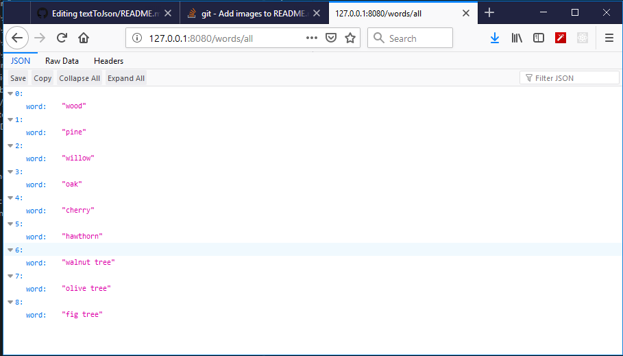

# textToJson
 
 reads file date/words.txt
 
 Model   ------- /src/main/java/com/java/code/model/Word.java
 
 Controller   -- /src/main/java/com/java/code/controller/MainController.java

 the controller sends it as JSON on http://127.0.0.1:8080/words/all
 
 

